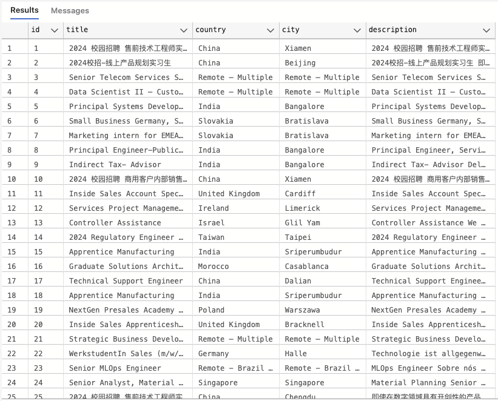

# Web Scraping Project: Dell Job Postings

This Python project scrapes job postings from the Dell Careers website ([https://jobs.dell.com/search-jobs](https://jobs.dell.com/search-jobs)) and saves the data into a MySQL database.

## Features

- Scrapes job postings from Dell Careers website.
- Extracts job title, country, city, and job description.
- Saves each job posting as a separate JSON file.
- Integrates with MySQL database to store job data in a table named `JOBS`.
  
Below is a screenshot of the `JOBS` table in the MySQL database, where the scraped job data is stored.  
  
Please note that you will need to update the MySQL connection details in the Python scripts to match your own database configuration before running the code.

